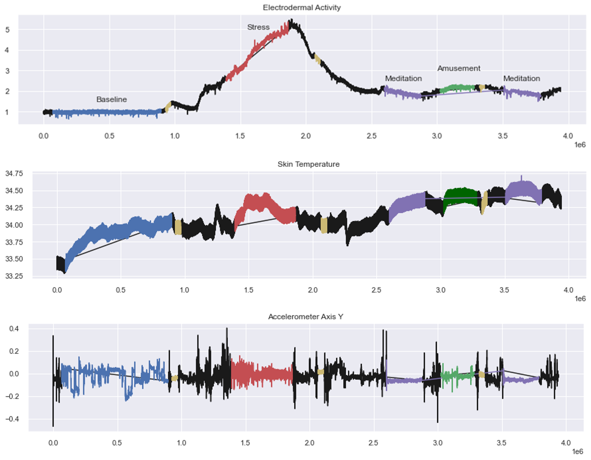

# WESAD_Sensor_Classification_XGBoost
XGBoost classification and analysis of WESAD sensor data.

Start with WESAD_S16_XGBoost_Base.ipynb

More coming soon!

## Introduction
Stress related or induced illnesses account for 75% to 90% of doctor office visits and the annual cost to industry is about $300 billion (The American Institute of Stress, 2020).  Effects from long-term stress can produce an increased risk of physiological and psychological disorders including heart complications, diabetes, ulcers, skin problems, loss of sexual desire, changes in appetite, chronic pain, arthritis, depression, increased use of alcohol and drugs, asthma, and anxiety (The American Institute of Stress, 2020).  Emotional stress has been recognized as equally important to heart disease as other risks such as diabetes, hypertension, and smoking (Doolittle, 2019).  In addition, stress has been shown to lower the immune system response resulting in increased susceptibility to flus, colds, and other infections (Doolittle, 2019).  

## Objectives
The focus was on the chest sensor data with the intent to build, test, and compare models and fine tune the best model or models to maximize model accuracy.  The first objective of this project was to test how well XGboost would classify (predict) stress compared to a baseline condition.  The second objective was to compare stress classification between using all chest features and using features from the chest that were equivalent to sensors found in wrist device. Although the number of subjects is too low to make any reliable analysis, analyses included stress between male and female and stress based on comfort level.  The aim, however, was to present examples of what else might be accomplished using this type of data: For example, environment conditions.  Additional goals included a greater understanding sensor data and learning more about XGBoost. 

## Test Models
Test models run were to determine how well some individual features or combination of features would perform using the XGBoost algorithm.  The final model architecture decision occurred after many trial and error experiments and applied to all subsequent models and subjects. All model test runs were in only the WESAD_S16_XGBoost_Base notebook.  Feature (attribute) choices and model runs for remaining 5 subjects had been chosen based-on the outputs from these test runs.  Models used in subsequent notebooks for subjects S4, S8, S11, S13, and S17 included only models allChest and accEdaTemp.  The WESAD_metrics_scores_analysis notebook included statistics and stress related analyses. 

## Methods 
The starting notebook, WESAD_S16_XGBoost_Base, is somewhat busy.  Some of the model runs are comparisons to the base model.  Additional scoring included AUC scores and balanced accuracy, but only in this notebook and not in subsequent notebooks.  Some of the explorations are not necessary but are nice to check out anyway.  It is important for this type of data, however, to look at the series plots to grasp what is occurring and to help with discovery.  Wrist sensors also found in the chest device included an accelerometer, electrodermal activity, and skin temperature. The model accEdaTemp selected from the chest device features resolved the problem of determining presumed wrist performance regarding stress.  In this case, the model accEdaTemp evolved from close examination of the plots shown in Figure 1. 
## Figure 1
 

## XGBoost 
XGBoost is an ensemble of gradient boosted decision trees that performs correlation filtering, automatically reduces the feature set, and is unaffected by outliers (Chen, et al., 2018).    XGBoost is probability-based and unaffected by scale factors, therefore requires no preprocessing such as normalization, standardization, or noise removal.  An advantage to using XGBoost when compared to other algorithms that rely on CPU usage is that it can use a GPU for multithreading parallel computing thereby reducing model run times (Chen, et al., 2018).  
An example of an automatic reduction of the feature set is apparent in the first two model runs, allChest and shortChest.  Feature importance from the allChest (all features) model showed an extremely low influence by the electromyogram attribute, Figure 2.  In the second model run, shortChest, the electromyogram attribute was left out.  However, scores for each model were essentially identical, which apparently shows that feature reduction worked.
## Figure 2
 

